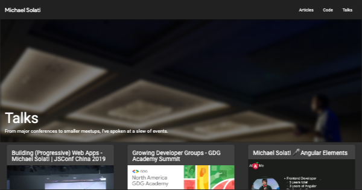

# Portfolio

A portfolio designed for lazy developers all over the world. With little configuration and maintanince let this application automatically update itself without you having to lift a finger!


As a Developer 🥑 (Advocate) I speak at events, write blog posts, and maintain some libraries. I wanted to create a website that would showcase all of this, and I created this project to fetch from [dev.to](https://dev.to), [GitHub](https://github.com) and a [YouTube](https://youtube.com) playlist!

- My work experience is ripped [LinkedIn](https://linkedin.com) via [Puppeteer](https://pptr.dev/) and shown on [`/`](https://michaelsolati.com).
- Articles I've written on dev.to are shown on [`/articles`](https://michaelsolati.com/articles).
- My most starred and recent GitHub repos are shown on [`/code`](https://michaelsolati.com/code).
- Recorded talks are fetched from a YouTube playlist and shown on the [`/talks`](https://michaelsolati.com/talks).

Almost all of this is configured from [`src/environments/environment.general.ts`](src/environments/environment.general.ts), which you can configure to display your own data, here's how...

---

## Getting Setup

We'll keep our first step simple and just run a `npm i` command. You will also want to have the `@angular/cli` and `firebase-tools` installed as global dependencies on your machine. Just run the command `npm i -g @angular/cli firebase-tools` and be sure to sign into your Google account for the `firebase-tools` with the command `firebase login`.

### Configuration

Some basic details used for generating links and meta details on the site is found in the [`src/environments/environment.general.ts`](src/environments/environment.general.ts) in the `site` sub-object of the `environment`. Below is an interface explaining the site's data structure.

```TypeScript
interface Site {
  baseURL: string; // Url of where site will be hosted, remove trailing `/`.
  email: string; // Email address that can be used as a LinkedIn login.
  name: string; // Your name.
  phone?: string; // Don't worry about this.
  twitter: string; // Twitter username, avoid `@`.
}
```

#### Pages

The site is configured to show four pages which are customized on [`src/environments/environment.general.ts`](src/environments/environment.general.ts) in the `pages` sub-object of the `environment`. The pages are structured almost the same for every page and can be easily customised with your details. Below is an interface explaining a page's data structure.

```TypeScript
interface Page {
  enabled: boolean; // Wether this page should be active on your website.
  name: string // Name of page for navbar.
  path: string; // Path for the page.
  username?: string; // Username for the page, does not show up for `youtube` page.
  playlist?: string; // Only for `youtube` page, put the playlist id here.
  title: string; // Text in `<title>` tag.
  header: string; // Text in `<h1>` of page.
  description: string; // Description used in `<meta name="description">` and in page's banner.
  topics: string[]; // Topics for unsplash url used as banner's image
}
```

#### Firebase

This application takes advantage of Firebase for the use of its [Cloud Functions](https://firebase.google.com/products/functions/), [Hosting](https://firebase.google.com/products/hosting), and [Google Analytics](https://firebase.google.com/docs/analytics). In the [Firebase console](https://console.firebase.google.com/) create a new application, and ensure that these features are enabled. Typically they would be enabled from the get-go, but you may want to check just in case.

Update the `.firebaserc` file in the root directory so that `projects.default` is assigned to your Project ID. The easiest way to do this is just to delete the file and run the command `firbase init` to assign it to your project.

Next update the `firebase` sub-object of the `environment` object in [`src/environments/environment.general.ts`](src/environments/environment.general.ts) with your Firebase config details.

You will also need to enable the YouTube Data API v3 for your Firebase application, which [you can do easily here](https://console.developers.google.com/apis/library/youtube.googleapis.com/).

### Generate Data

With [`src/environments/environment.general.ts`](src/environments/environment.general.ts) fully customized it's time to generate the data for our pages, run the following command:

```bash
npm run data
```

You will be asked for your LinkedIn password, this is used for the Puppeteer script which will pull your data

This command will:

- Generate `data.ts` files for every page.
- Grab your `dev.to` profile picture and save it to `./src/assets/profile.webp` as well as generate PWA icons.
- Update the `./src/manifest.webmanifest` files to include your name.
- Save all the cover image or social image from your dev.to posts.
- Save all the previews images of the YouTube videos in the playlist.

If you don't want to input your LinkedIn password everytime you run the script you can create a `.env` file like below.

```txt
DEVTO=
GITHUB=
LINKEDIN_ACCOUNT=
LINKEDIN_EMAIL=
LINKEDIN_PASSWORD=
YOUTUBE=
YOUTUBE_APIKEY=
```

Whatever field you fill out will be used. DO NOT COMMIT THIS FILE!

Optionally you can set `LINKEDIN_PASSWORD` as an environment variable, this works better for CI. [Like with GitHub Actions.](.github/workflows/firebase-deploy.yml)

#### Screenshots

Finally we want to generate screenshots that can be used for sites like Twitter of Facebook. Run the following command:

```bash
npm run screenshots
```

And screenshots for every page will be generated, like below.



---

## Wrapping Up

With everything configured and data generated you can test the site by running:

```bash
npm run start
```

If everything looks good then we're ready to deploy to firebase, run:

```bash
npm run deploy
```

Enjoy!
